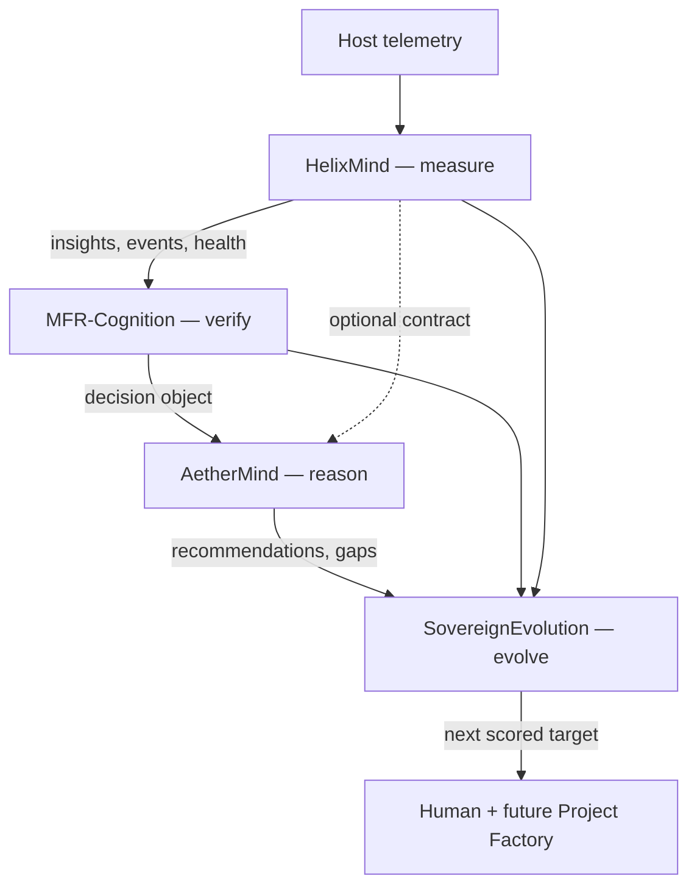

# Architecture

FathiMind is four repositories, one doctrine.



Dashed arrows are **planned contracts**. Solid arrows from Helix/MFR/Aether into SovereignEvolution today are **analysis of public files**, not a runtime bus.

## Layer contracts (intent)

### Event (HelixMind)

```json
{
  "id": "hex-signature",
  "timestamp": "ISO-8601",
  "generation": 32,
  "type": "resource_pressure",
  "severity": "warning",
  "confidence": 0.0,
  "signals": ["cpu", "memory", "load"],
  "explanation": "string"
}
```

### Decision (MFR-Cognition)

```json
{
  "timestamp": "ISO-8601",
  "status": "stable",
  "confidence": 0.85,
  "input": { "cpu": 0, "memory": 0, "disk": 0 },
  "evidence": ["string"],
  "anomalies": ["string"],
  "signature": "hex"
}
```

### Recommendation (AetherMind)

```json
{
  "action": "continue_normal_operations",
  "priority": "info",
  "reason": "string",
  "confidence": 0.8,
  "hypotheses": ["string"]
}
```

### Target (SovereignEvolution)

```json
{
  "id": "baseline-learning",
  "title": "string",
  "score": 2744,
  "description": "string"
}
```

These four objects are the shared language. Implementation of `shared-contracts` freezes them as versioned schemas.

## Non-goals

- Merging the four repositories
- A single process that "does everything"
- Cosmetic README churn as evolution
- Storing personal data in traces
